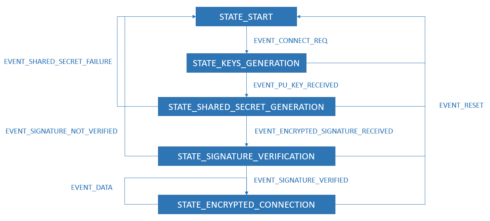

# 
SecureBLE

Secure communication between Arduino Uno microcontroller and Android application over BLE (Bluetooth Low Energy). Establishment of secure communication is done by using <em><strong>Elliptic-Curve Diffie-Hellman</strong></em> key exchange protocol in order to cover <em><strong>privacy</strong></em> aspect and <em><strong>Station to Station</strong></em> protocol in order to cover <em><strong>authentication</strong></em> aspect.

### Content

1. [Bluetooth Low Energy (BLE)](#bluetooth-low-energy-ble)
2. [ECDH key exchange protocol](#ecdh-key-exchange-protocol)
3. [STS protocol](#sts-protocol)
4. [State Machine](#state-machine)
5. [Messages](#messages)
6. [Arduino](#arduino)
7. [Performances](#performances)

### Bluetooth Low Energy (BLE)

BLE or Bluetooth Low Energy is a wireless personal area network technology.

  

#### GAP (Generic Access Profile)

GAP is the layer of the BLE stack which determines the network topology of the BLE system. Based on this layer, there are two roles in the BLE communication: **BLE GAP Central** and **BLE GAP Peripheral**.

The GAP Central is typically the device which initiates the connection with the GAP Peripheral. Once the two devices are connected, they will perform a “pairing” process where they will exchange the information necessary to establish an encrypted connection.

#### GATT (Generic Attribute Profile)

GATT is the layer of the BLE stack used by the application for data communication between two connected devices. Data is passed and stored in the form of characteristics which are stored in memory of BLE device. When two devices are connected, they obtain one of two roles: **GATT Server** and **GATT Client**.

The GATT Server is the device containing the characteristic database that is being read or written by a GATT Client. Consider characteristics as groups of information called attributes.

A typical characteristic is composed of the following attributes:

- Characteristic Value
- Characteristic Declaration
- Client Characteristic Configuration
- Characteristic User Description

Max number of bytes that is possible to transfer over GATT layer at once is 20–23. Real number depends on how long GATT specific messages are.

Refer to this [article](http://dev.ti.com/tirex/content/simplelink_cc2640r2_sdk_1_40_00_45/docs/blestack/ble_user_guide/html/ble-stack-3.x/gatt.html) about GATT layer of the BLE protocol stack.

#### Specs

- \> 100m range
- 1 Mbit/s over the air data rate
- not specified number of active slaves
- 6ms latency

#### Security 

***Pairing*** is the process by which two BLE devices exchange device information so that secure link can be established. The process varies somewhat between the BLE 4.2 devices and the older 4.1 and 4.0 devices.

In BLE 4.2, devices use ECDH key exchange in their pairing process. The only problem with ECDH key exchange is that *it does not give the user a way to verify the authenticity of the connection*. Therefore, it is still vulnerable to MITM attacks.

#### Security issues

- passive eavesdropping
- MITM attacks
- identity tracking

Refer to this [article](https://www.digikey.com/eewiki/display/Wireless/A+Basic+Introduction+to+BLE+Security) about BLE security. 

#### Comparisons between BLE, WiFi and LoRa

- [BLE vs WiFi](https://hackernoon.com/ble-vs-wi-fi-a-comparison-of-wireless-technology-for-iot-product-development-1c7be179f379)
- [BLE vs LoRa](https://www.mwrf.com/systems/lorable-puts-iot-everywhere-map)
- [WiFi vs LoRa](https://medium.com/bytes-io/lora-vs-wifi-3-questions-d9c93137fca)

### ECDH key exchange protocol

  

- Arduino Uno board as a user A selects its private key **PRarduino**, an integer less than the order *n*, and generates public key **PUarduino** which belongs to a point on elliptic curve
- Android app as a user B selects its private key **PRandroid**, an integer less than the order *n*, and generates public key **PUandroid** which belongs to a point on elliptic curve
- after exchanging each other's public key, both, Arduino Uno board and Android app, generate shared secret **K** which is then used for secure communication

Refer to this [article](http://www.ieeesmc.org/newsletters/back/2010_12/main_article3.html) about security mechanism for clustered wireless sensor networks based on elliptic curve cryptography.

### STS protocol

  

>...uses arithmetic in a multiplicative group with generator *G*. Exponents *arduino* and *android* are chosen randomly by *Arduino* and *Android* respectively and are used to form the session key *K*.

>... *SIG* represents the signature by the principal *X* on the string in the brackets while *{ M }* denotes symmetric encryption of message M using key K. The particular signature algorithm chosen does not matter for the protocol...

*[Boyd, C.; Mathuria, A.: "Protocols for Authentication and Key Establishment", Springer, 1998.]*

- Arduino Uno board sends its public ECDH key across communication channel
- Android app returns its public ECDH key along with symmetrically encrypted signature of concatenated public ECDH keys of both, Arduino Uno board and Android app
- Arduino Uno board sends back its symmetrically encrypted signature
- both, Arduino Uno board and Android app verify each other's signature

**Symmetric**, i.e. **session key**, is created by applying **SHA-256 cryptographic hash function** on the shared secret generated during Elliptic-Curve Diffie-Hellman key exchange protocol.

### State Machine

State Machines in general represent a set of complex rules and conditions. For the purpose of this project, State Machine is created in order to simplify execution of Elliptic-curve Diffie-Hellman key exchange protocol and also to simulate its states and transitions. The same State Machine is implemented on both, Arduino Uno board and Android device.

  

### Messages

All messages exchanged during both, key exchange protocol and encrypted communication, have the following template: `$<MESSAGE_TYPE>=<MESSAGE_CONTENT>;`. `MESSAGE_CONTENT` part of the message is optional.

Supported message types:
- **CONNECT** - initiates ECDH key exchange protocol
- **PU** - carries ECDH public key from one entity to another
- **FAILURE** - indication for unsuccessful generation of a shared secret
- **SIG** - carries encrypted signature
- **SIGVER** - signature verified
- **SIGNVER** - signature not verified
- **DATA** - carries data from one entity to another
- **RESET** - resets ECDH key exchange protocol

### Arduino

For the purpose of this project, Arduino Uno is used along with Bluetooth module HM-10.

Wiring the HM-10 to the Arduino Uno board:

| Arduino Uno | HM-10 |
|:-----------:|:-----:|
|      D2     |   TX  |
|      D3     |   RX  |
|     GND     |  GND  |
|    3.3V     |  VCC  |

#### Arduino crypto libraries

- [Arduino Cryptography Library](https://rweather.github.io/arduinolibs/index.html)

### Performances

| Operation | Time |
|:-----------:|:-----:|
| Generating ECDH key pair | 3259 ms |
| Generating shared secret | 3241 ms |
| AES256 key setup | 437 us |
| AES256 encryption (per byte) | 24 us |
| AES256 decryption (per byte) | 46 us |
| SHA256 hashing | 2835 us |